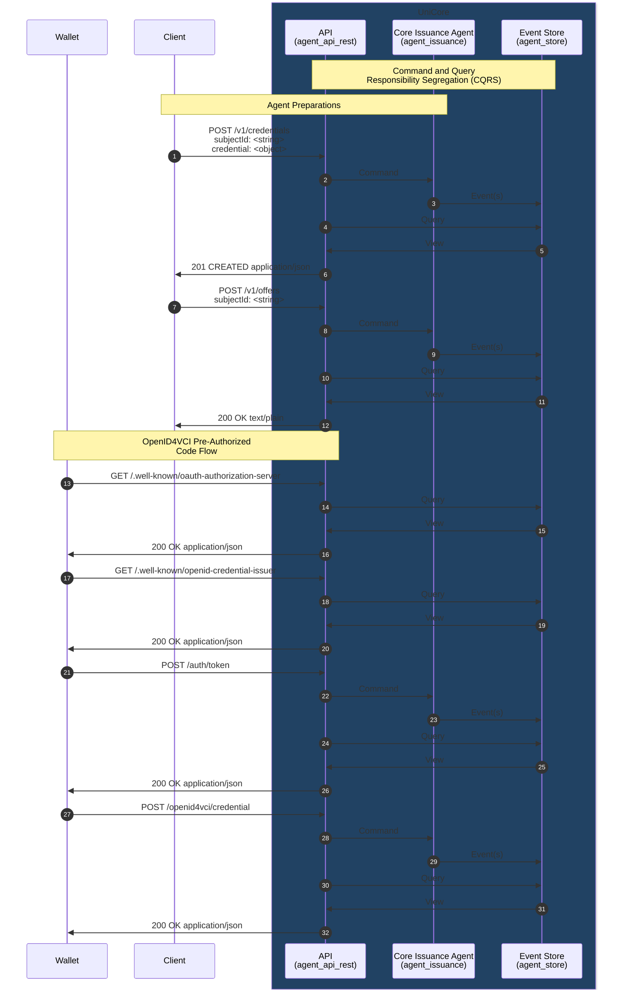

# SSI Agent

## API specification

[Follow these instructions](./agent_api_rest/README.md) to inspect the REST API.

## Build & Run

Build and run the **SSI Agent** in a local Docker environment following [these steps](./agent_application/docker/README.md).

