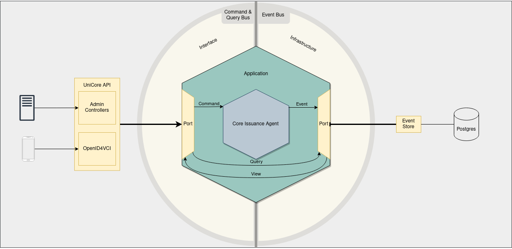

# SSI Agent

## API specification

[Follow these instructions](./agent_api_rest/README.md) to inspect the REST API.

## Build & Run

Build and run the **SSI Agent** in a local Docker environment following [these steps](./agent_application/docker/README.md).

## Configuration

All configuration options are documented [here](./agent_application/CONFIGURATION.md).

## Breaking changes

From time to time breaking changes can occur. Please make sure you read the [CHANGELOG](./CHANGELOG.md) before updating.

## Architecture



UniCore makes use of several practical architectural principles—specifically, Hexagonal Architecture, CQRS, and Event
Sourcing. Together, these principles contribute to a robust and scalable software solution.

### Hexagonal Architecture

Hexagonal Architecture promotes modularity by separating the core business logic from external dependencies. UniCore's
core functionality remains untangled from external frameworks, making it adaptable to changes without affecting the
overall system.

#### Core

The core business logic of UniCore currently consists of the [**Core Issuance Agent**](./agent_issuance/README.md). This
component is responsible for handling the issuance of credentials and offers. It defines the rules by which incoming
**Commands** can change the state by emitting **Events**. The Core Issuance Agent has two major functions:

- **Preparations**: Preparing the data that will be used in the issuance of credentials and credential offers.
- **Credential Issuance**: Issuing credentials according to the OpenID for Verifiable Credential Issuance specification.

#### Adapters

UniCore's adapters are responsible for handling the communication between the core and external systems. Adapters can
either be **Inbound** or **Outbound**. Inbound adapters are responsible for receiving incoming requests and translating
them into commands that can be understood by the core. Outbound adapters are responsible for translating the core's
**Events** into outgoing requests. In our current implementation, we have the following adapters:

- [**REST API**](./agent_api_rest/) (Inbound): The REST API is responsible for receiving incoming HTTP requests from clients and translating them
  into commands that can be understood by the core.
- [**Event Store**](./agent_store/) (Outbound): The Event Store is responsible for storing the events emitted by the
  core. By default, the Event Store is implemented using PostgreSQL. Alternatively, it can be implemented using an
  in-memory database for testing purposes.

#### Application

The [**Application**](./agent_application/) is responsible for orchestrating the core and adapters. It is responsible for initializing the core and
adapters and connecting them together.

### CQRS

CQRS is a design pattern that separates the responsibility for handling commands (changing state) from handling queries
(retrieving state).

- **Commands**: Commands are actions that are responsible for executing business logic
  and updating the application state.
- **Queries**: Queries are responsible for reading data without modifying the state.

The separation of commands and queries simplifies the design and maintenance of the application and allows for the
optimization of each side independently.

### Event Sourcing

Event Sourcing is a pattern in which the application's state is determined by a sequence of events. Each event signifies a state change and is preserved in an event store. These **Events** serve as immutable facts about alterations in the application's state. The **Event Store**, functioning as a database, records events in the order of their occurrence. Consequently, it enables the reconstruction of the application's state at any given moment. This pattern not only ensures a dependable audit log for monitoring changes but also facilitates querying the system's state at various intervals.

## Interaction Sequence

This sequence diagram illustrates the dynamic interaction flow within UniCore, focusing on the preparation and issuance of credentials and offers. The diagram also illustrates the OpenID4VCI Pre-Authorized Code Flow, which is used by wallets to obtain access tokens and credentials.


```
Agent Preparations
    1: The client sends a `POST` request to the `/v0/credentials` endpoint. The request body contains a (unique) subject ID and a credential object.
  2-3: The API translates the request into a Command and sends it to the core. The core processes the Command and emits one or more Events. The Events are stored in the Event Store.
  4-5: The API sends a Query to the event store to retrieve the View(s) to be returned by the API.
    6: The API returns a `201 CREATED` response with the Credentials View(s) in the response body.
    7: The client sends a `POST` request to the `/v0/offers` endpoint. The request body contains the subject ID of the subject for which the offer is being created.
  8-9: See steps 2-3.
10-11: See steps 4-5
   12: The API returns a `200 OK` response with the Offer View in the response body.

OpenID4VCI Pre-Authorized Code Flow
   13: The wallet sends a `GET` request to the `/.well-known/oauth-authorization-server` endpoint.
14-15: See steps 4-5.
   16: The API returns a `200 OK` response with the OpenID4VCI Authorization Server Metadata in the response body.
   17: The wallet sends a `GET` request to the `/.well-known/openid-credential-issuer` endpoint.
18-19: See steps 4-5.
   20: The API returns a `200 OK` response with the OpenID4VCI Credential Issuer Metadata in the response body.
   21: The wallet sends a `POST` request to the `/auth/token` endpoint.
22-23: See steps 2-3.
24-25: See steps 4-5.
   26: The API returns a `200 OK` response with the access token in the response body.
   27: The wallet sends a `POST` request to the `/openid4vci/credential` endpoint.
28-29: See steps 2-3.
30-31: See steps 4-5.
   32: The API returns a `200 OK` response with the credential(s) in the response body.
```
