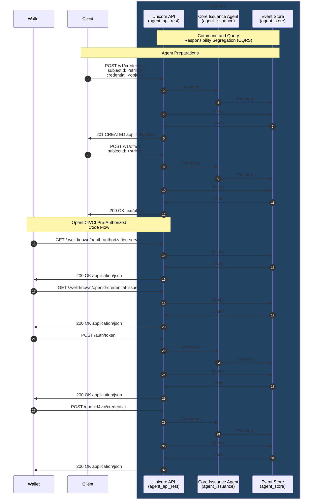

# SSI Agent

## API specification

[Follow these instructions](./agent_api_rest/README.md) to inspect the REST API.

## Build & Run

Build and run the **SSI Agent** in a local Docker environment following [these
steps](./agent_application/docker/README.md).

## Architecture

UniCore makes use of several practical architectural principles—specifically, Hexagonal Architecture, CQRS, and Event
Sourcing. Together, these principles contribute to a robust and scalable software solution.

### Hexagonal Architecture
Hexagonal Architecture promotes modularity by separating the core business logic from external dependencies. UniCore's
core functionality remains untangled from external frameworks, making it adaptable to changes without affecting the
overall system.

#### Core
The core business logic of UniCore currently consists of the [**Core Issuance Agent**](./agent_issuance/README.md). This
component is responsible for handling the issuance of credentials and offers. It defines the rules by which incoming
**Commands** can change the state by emitting **Events**. The Core Issuance Agent has two major functions:
- **Preparations**: Preparing the data that will be used in the issuance of credentials and credential offers.
- **Credential Issuance**: Issuing credentials according to the OpenID for Verifiable Credential Issuance specification.

#### Adapters
UniCore's adapters are responsible for handling the communication between the core and external systems. Adapters can
either be **Inbound** or **Outbound**. Inbound adapters are responsible for receiving incoming requests and translating
them into commands that can be understood by the core. Outbound adapters are responsible for translating the core's
**Events** into outgoing requests. In our current implementation, we have the following adapters:
- [**REST API**](./agent_api_rest/) (Inbound): The REST API is responsible for receiving incoming HTTP requests from clients and translating them
  into commands that can be understood by the core.
- [**Event Store**](./agent_store/) (Outbound): The Event Store is responsible for storing the events emitted by the
  core. By default, the Event Store is implemented using PostgreSQL. Alternatively, it can be implemented using an
  in-memory database for testing purposes.

#### Application
The [**Application**](./agent_application/) is responsible for orchestrating the core and adapters. It is responsible for initializing the core and
adapters and connecting them together.

### CQRS
CQRS is a design pattern that separates the responsibility for handling commands (changing state) from handling queries
(retrieving state).
- **Commands**: Commands are actions that are responsible for executing business logic
  and updating the application state.
- **Queries**: Queries are responsible for reading data without modifying the state.

The separation of commands and queries simplifies the design and maintenance of the application and allows for the
optimization of each side independently.

### Event Sourcing
Event Sourcing is a pattern where the state of an application is determined by a sequence of events. Each event
represents a state change and is stored in an event store. **Events** represent immutable facts about the state changes
in the application. The **Event Store** is a database that stores the events in the order they were applied. Therefore,
it can be used to reconstruct the state of the application at any point in time. The added benefit of this is that this
pattern provides a reliable audit log for tracking changes over time. It also supports querying the state of the system
at different points in time.

