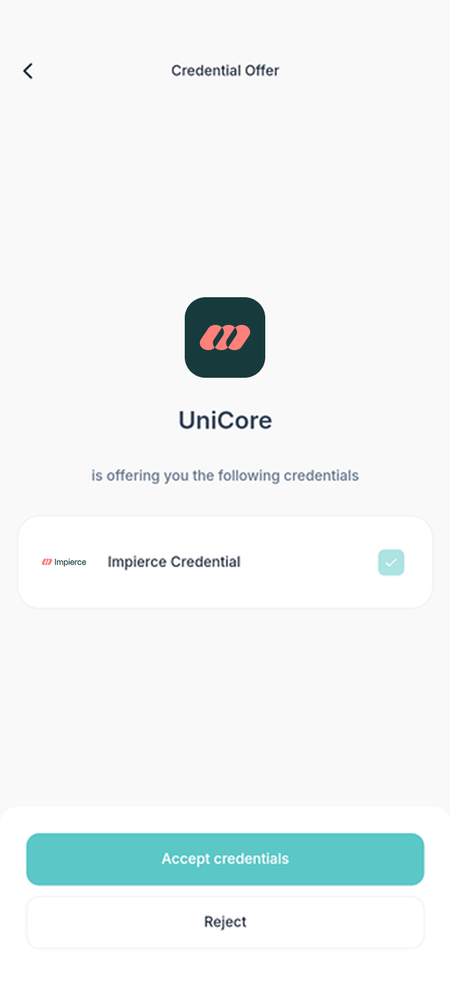
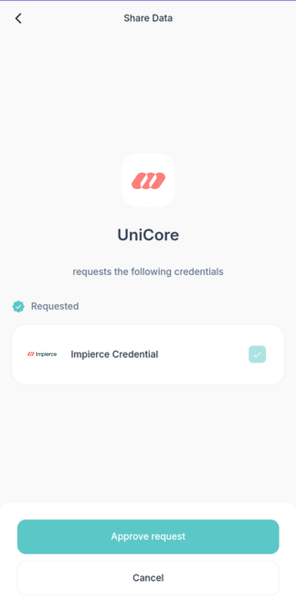

# Quick Start

This guide will help you quickly get started with **UniCore**. You will:

1. Deploy a UniCore instance locally using Docker Compose.
2. Issue a Credential to a user.
3. Verify that Credential.

### Prerequisites

- [Docker](https://docs.docker.com/engine/install/)
- **UniMe** app or any other Identity Wallet that supports the following standards:
  - **OpenID for Verifiable Credential Issuance** Working Group Draft 13
  - **OpenID for Verifiable Presentations** Working Group Draft 20
  - **Self-Issued OpenID Provider v2** Working Group Draft 13

---

## Download UniMe

Download the UniMe app on your mobile device:

- [App Store](https://apps.apple.com/us/app/unime-identity-wallet/id6451394321)
- [Google Play Store](https://play.google.com/store/apps/details?id=com.impierce.identity_wallet)

---

## Configuration

### 1. Clone the UniCore Repository

Open a terminal and clone the UniCore repository:

```bash
git clone https://github.com/impierce/ssi-agent.git && cd ssi-agent
```

### 2. Copy the Example Configuration File

Copying the example configuration file sets up default settings required by UniCore.

```bash
cp agent_application/example.config.yaml agent_application/config.yaml
```

### 3. Navigate to the Docker Directory

```bash
cd agent_application/docker
```

### 4. Copy the example environment file

```bash
cp .env.example .env
```

### 5. Set the `UNICORE__URL` Environment Variable and Update the .env File

First, set the `UNICORE__URL` environment variable using your private IP address:

```bash
export UNICORE__URL=http://<your-private-ip-address>:3033
```

:::note
In a typical UniCore setup, the `UNICORE__URL` variable would be set in the `.env` file. However, for the purpose of this quick start, it is more practical to set the variable as shown above, allowing it to be reused in the `curl` commands throughout this guide.
:::

- Replace `<your-private-ip-address>` with your machine's local IP address.
  - On macOS/Linux, find it using:
  ```bash
  ifconfig
  ```
  - On Windows, find it using:
  ```powershell
  ipconfig
  ```
  Next, in the `.env` file, set the `UNICORE__URL` variable to reference the environment variable:

```bash
UNICORE__URL=${UNICORE__URL}
```

This configuration ensures that Docker Compose uses the `UNICORE__URL` environment variable you've set in your shell.

:::note
Make sure to export the `UNICORE__URL` environment variable in the same terminal session where you will run `docker compose
up`, or ensure that the variable is available in your environment.
:::

### 6. Update the Docker Compose File

Open the `compose.yaml` file in a text editor and update the `image` value for the `ssi-agent` service to `impiercetechnologies/ssi-agent:1.0.0-beta.8` (or newer version).

```yaml
ssi-agent: impiercetechnologies/ssi-agent:1.0.0-beta.9
```

---

## Deployment

Run the following command to deploy UniCore:

```bash
docker compose up
```

This command starts the UniCore services defined in your `compose.yaml` file.

## Issuing a Credential

To issue a Credential, follow these steps:

### 1. Post the Credential Data to UniCore

Open a new terminal window and ensure the `UNICORE__URL` environment variable is set (if not, set it again):

```bash
export UNICORE__URL=http://<your-private-ip-address>:3033
```

Then run:

```bash
curl --location "$UNICORE__URL/v0/credentials" \
--header 'Content-Type: application/json' \
--data '{
    "offerId":"001",
    "credentialConfigurationId": "w3c_vc_credential",
    "credential": {
        "credentialSubject": {
            "first_name": "John",
            "last_name": "Doe"
        }
    },
    "expiresAt": "never"
}'
```

This command sends a POST request to create a new Credential Offer with the specified data.

### 2. Retrieve the URL-Encoded Credential Offer

Run:

```bash
curl --location "$UNICORE__URL/v0/offers" \
--header 'Content-Type: application/json' \
--data '{
    "offerId": "001"
}'
```

This returns the URL-encoded Credential Offer.

### 3. Render the Credential Offer as a QR Code

To proceed, you need to render the URL-encoded Credential Offer as a QR code. You can use **any method** or tool you
prefer to generate the QR code. Here are some options:

**Option 1: Using Command Line with `qrencode`**

Install `qrencode` (if not already installed):

- macOS:

```bash
brew install qrencode
```

- Ubuntu/Debian:

```bash
sudo apt-get install qrencode
```

Generate the QR code:

```bash
qrencode -o credential-offer.png -s 10 '<URL-ENCODED-CREDENTIAL-OFFER>'
```

- Replace `<URL-ENCODED-CREDENTIAL-OFFER>` with the actual value returned from the previous step.
  :::note
  The URL-encoded Credential Offer to be encoded must be enclosed within single quotes ' '.
  :::

Open the QR code image:

```bash
open credential-offer.png
```

**Option 2: Using Online QR Code Generators**

- Go to an online QR code generator such as [QR Code Generator](https://www.the-qrcode-generator.com/).
- Paste the URL-encoded Credential Offer into the text field (as Plain Text).
- Generate the QR code image.

:::note
The key requirement is to generate a QR code from the URL-encoded Credential Offer so that it can be scanned by the
UniMe app.
:::

### 4. Scan the QR Code with UniMe

- Open the UniMe app on your mobile device.
- Scan the QR code to accept the Credential Offer.



After accepting, the Credential will appear in the UniMe app.

---

## Verifying a Credential

Now, request the user to present their Credential:

### 1. Create a URL-Encoded Authorization Request

Ensure the `UNICORE__URL` environment variable is set (if not, set it again):

```bash
export UNICORE__URL=http://<your-private-ip-address>:3033
```

Then run:

```bash
curl --location "$UNICORE__URL/v0/authorization_requests" \
--header 'Content-Type: application/json' \
--data '{
    "nonce": "this is a nonce",
    "state": "state_id",
    "presentation_definition": {
        "id":"Verifiable Presentation request for sign-on",
        "input_descriptors":[
            {
                "id":"Request for Verifiable Credential",
                "constraints":{
                    "fields":[
                        {
                            "path":[
                                "$.vc.type"
                            ],
                            "filter":{
                                "type":"array",
                                "contains":{
                                    "const":"VerifiableCredential"
                                }
                            }
                        }
                    ]
                }
            }
        ]
    }
}'
```

This creates an Authorization Request specifying the type of Credential that is being requested.

### 2. Render the Authorization Request as a QR Code

Similar to how you generated the QR code for the Credential Offer, you now need to render the URL-encoded Authorization
Request as a QR code. You can use the same method you used earlier:

- If using `qrencode`, run:

```bash
qrencode -o authorization-request.png -s 10 '<URL-ENCODED-AUTHORIZATION-REQUEST>'
```

- Replace `<URL-ENCODED-AUTHORIZATION-REQUEST>` with the actual value returned from the previous step.
  :::note
  The URL-encoded Authorization Request to be encoded must be enclosed within single quotes ' '.
  :::
- Open the QR code image:

```bash
  open authorization-request.png
```

- If using an online tool or app, input the URL-encoded Authorization Request to generate the QR code.

:::info
The process of generating the QR Code is exactly the same; you're just using the new URL-encoded Authorization Request instead of the Credential
Offer.
:::

### 3. Scan the QR Code with UniMe

- Now scan the QR code using the UniMe app.
- The app will prompt to share the Credential.



Upon acceptance, UniCore will verify the validity of the Credential.

In order to check whether the Credential was successfully verified by UniCore, you can run the following command:

```bash
curl --location 'http://localhost:3033/v0/authorization_requests/state_id'
```

This will return an object containing a `"vp_token"` field. If the value of this field is not `null`, the Credential was successfully verified.

---

## Troubleshooting

- **Problem**: QR code not scanning.

  **Solution**: Ensure the QR code contains the correct URL-encoded data and that it's clear enough for the camera to read.

- **Problem**: Cannot connect to UniCore from mobile device.

  **Solution**: Check that both devices are on the same network and that firewall settings allow incoming connections on port `3033`.

---

## Additional Notes

- **Firewall Settings**: Ensure your machine allows incoming connections on the required ports.
- **Access from Mobile Device**: Your mobile device must be on the same network as your UniCore instance.
- **Environment Variables**: Remember that environment variables set in your shell are not persisted across terminal sessions. You may need to set `UNICORE__URL` in each new terminal or include it in your shell's startup script.

---

By following this guide, you've:

- Deployed UniCore locally.
- Issued a Credential to a user.
- Verified the Credential using the UniMe app.
